# springbootA356
springbootA356美妆化妆品商城网站Vue3
 
## 查看主页获取源码

### 一、作品包含

源码+数据库+万字设计文档+全套环境和工具资源+部署教程

### 二、项目技术

前端技术：Html、Css、Js、Vue3、Element-plus

数据库：MySQL

后端技术：Java、Spring Boot、MyBatis

  

### 三、运行环境

开发工具：IDEA/eclipse

数据库：MySQL5.7

数据库管理工具：Navicat10以上版本

环境配置软件： JDK1.8+Maven3.6.3

前端Nodejs：16

### 四、项目介绍
项目编号：springbootA356

美妆化妆品商城网站为商家和消费者搭建起线上交易桥梁，一方面为商家提供展示、销售平台以拓展市场、提升品牌影响力、降低营销成本，另一方面为消费者提供丰富多样的产品、便捷的购物体验。

该时尚美妆电商网站系统支持用户登录注册、个人信息与充值管理，可进行商品分类、展示、搜索、添加、修改、删除等操作，具备订单全流程管理功能，同时方便管理员对各类信息及轮播图进行管理 。 

### 五、运行截图

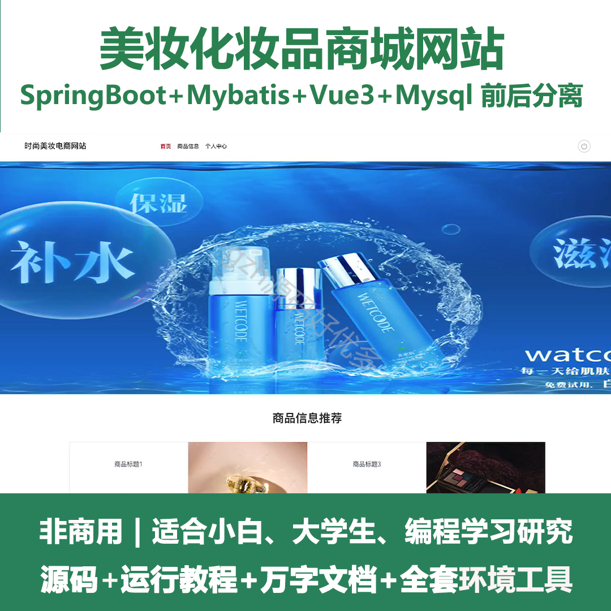
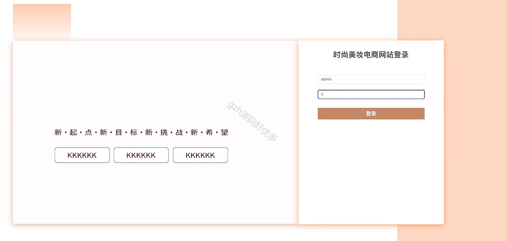
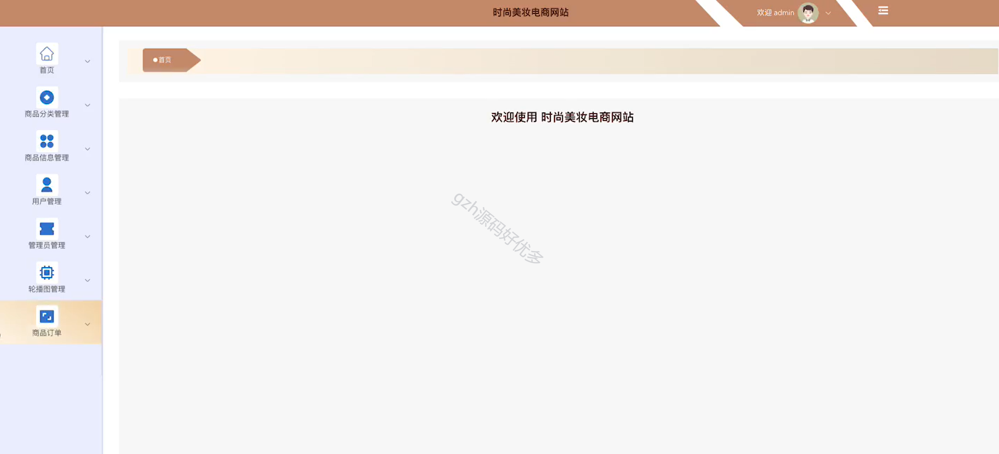
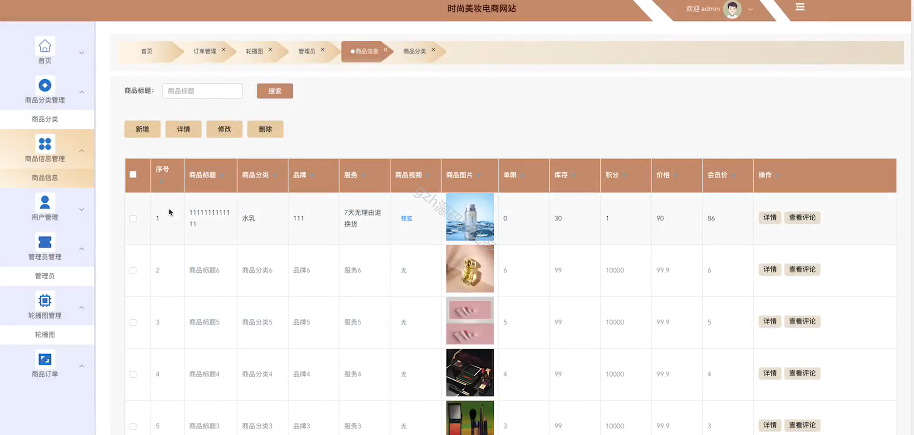
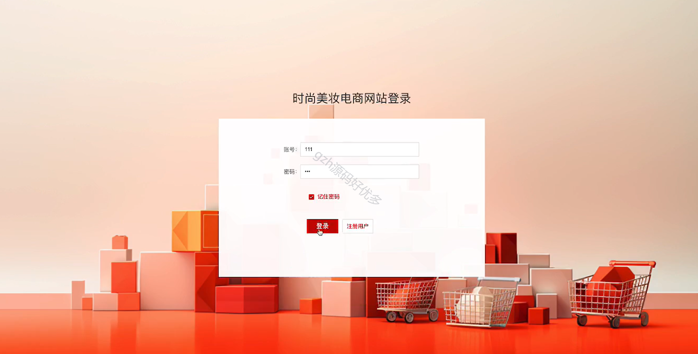
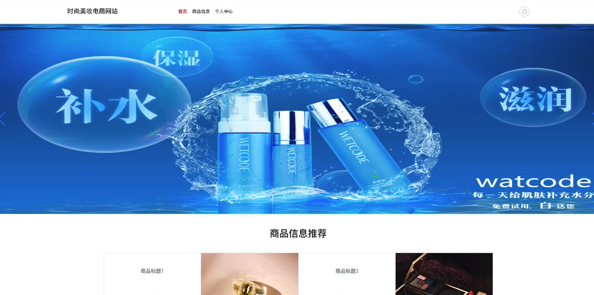
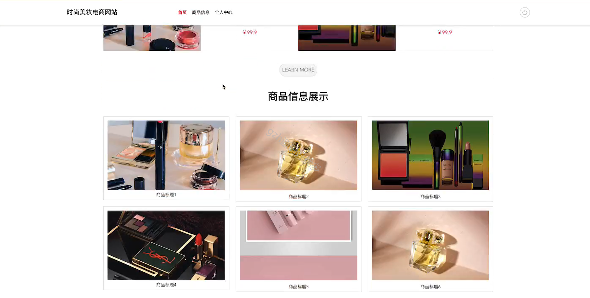
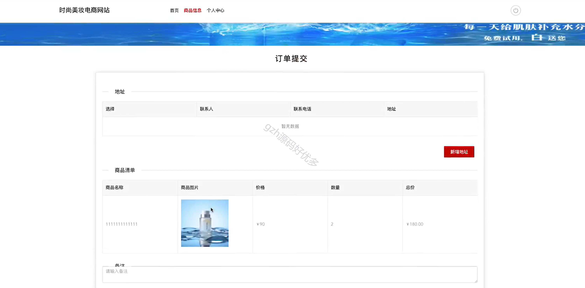
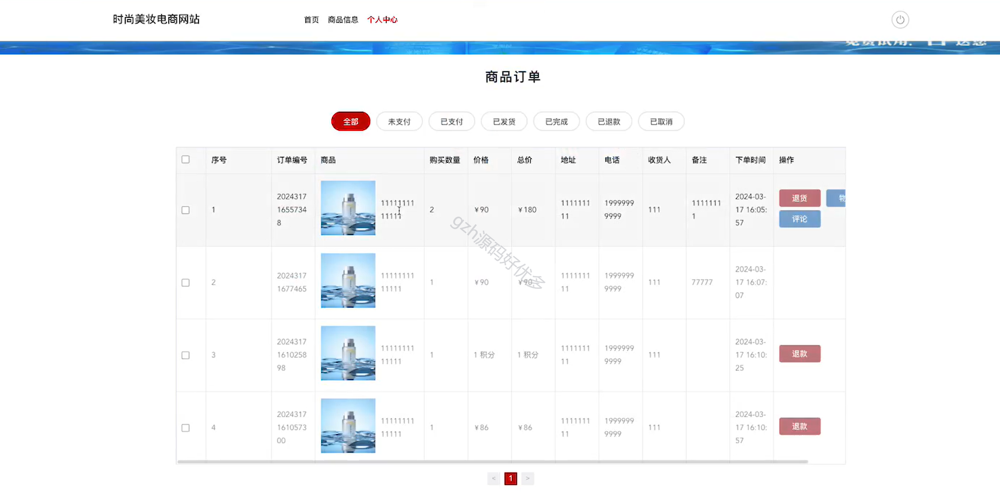
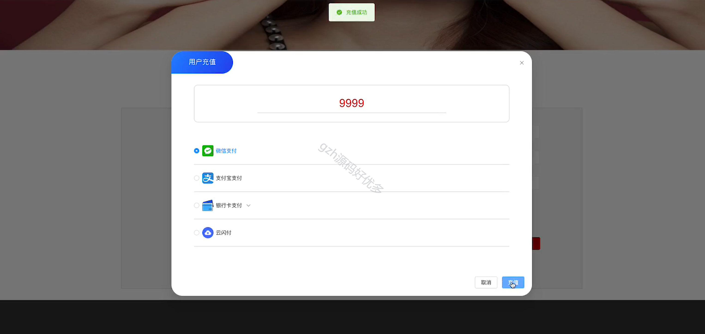
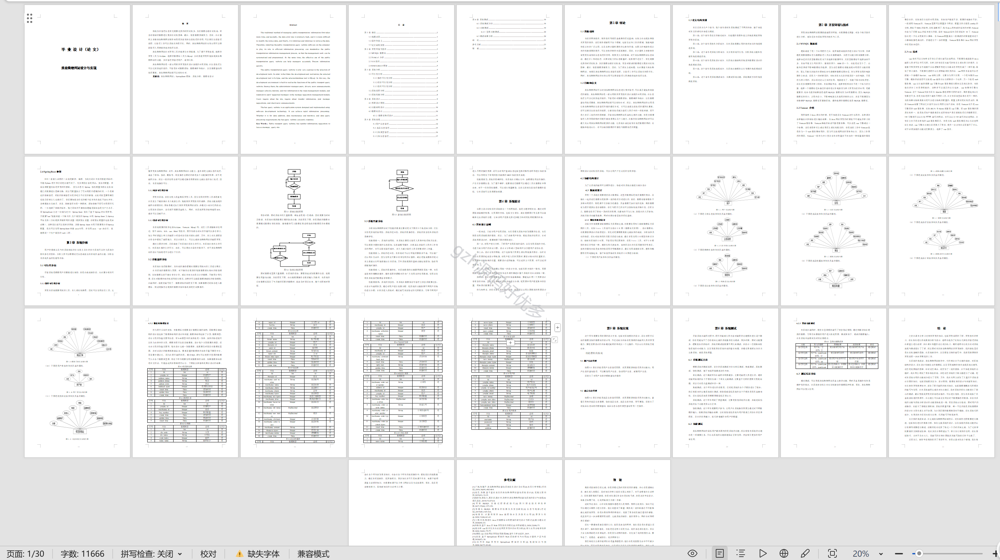

  
